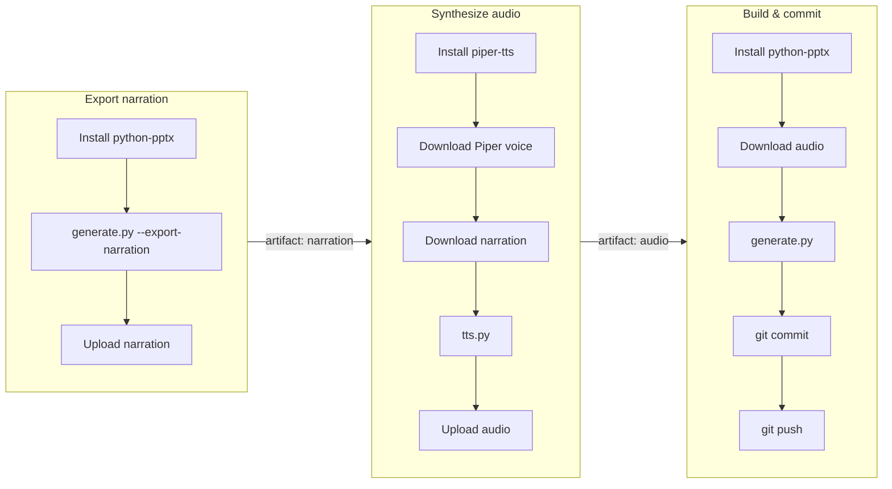

# markdown_to_pptx

箇条書きの Markdown を書くだけで、ナレーション音声付きの PowerPoint（`.pptx`）が作れるツール。

## なぜこれを使うか

* **無料で利用可能** — 音声合成はクラウドAPIではなく Piper（ローカルTTS）を使うため、
  課金なしで音声付きスライドまで作れるｖ
* **音声ナレーション込みは珍しい** — PowerPointを自動生成してくれるAIツール自体は増えているが、
  音声まで自動で挿入してくれる無料サービスは今のところ少ない
* **開発環境の構築が不要** — GitHub Actions でも
  `.pptx` が生成できる。手元に Python や Piper の環境を用意しなくてもよい
* **レイアウトが崩れない** — 生成AIに `.pptx` 生成ごと丸投げすると、指定したテンプレートの
  デザインが再現されず崩れることがある。このツールは `template.pptx` のレイアウトに
  テキストとナレーション音声を機械的に流し込むだけなので、体裁が崩れない

## Repository Structure

```text
.
├── README.md         # このファイル（変換仕様）
├── slide.md           # スライドの中身（編集するのはここ）
├── template.pptx       # レイアウトテンプレート（PowerPoint等で直接編集する。コードは触らない）
├── slide.pptx           # generate.py が生成する成果物
├── .github/workflows/
│   └── generate.yml       # Actionsで generate.py → tts.py → generate.py を実行し slide.pptx をコミット
└── src/
    ├── generate.py          # slide.md（+ audio/*）→ slide.pptx
    ├── tts.py                 # narration/*.txt → audio/*.wav（Piperでローカル音声合成）
    ├── requirements.txt
    ├── voices/                 # Piperの音声モデル（download_voicesで取得、gitignore対象）
    ├── narration/               # generate.py が書き出すナレーション原稿（slide-N.txt / slide-N.json）
    └── audio/                    # tts.py が生成するナレーション音声（slide-N.wav）
```

## 使い方

まず `slide.md` を編集する（記法は後述）。そのうえで、以下のどちらかの方法で `.pptx` に変換する。

**注意**: ナレーション原稿内の英字は発音が崩れやすいので、カタカナで書く（例: `Piper` → `パイパー`）。

### GitHub Actions で実行する場合

GitHub の Actions タブから `generate` ワークフローを `Run workflow` で実行すると、
`slide.pptx` が更新されてコミットされる。更新された`slide.pptx` をダウンロードする。



### ローカルで実行する場合

```bash
python3.13 -m venv .venv
.venv/bin/pip install -r src/requirements.txt
.venv/bin/python -m piper.download_voices --download-dir src/voices ja_JA-hi_fi_captain-medium

.venv/bin/python src/generate.py slide.md --export-narration   # src/narration/*.txt を書き出す（pptxはまだ作らない）
.venv/bin/python src/tts.py                                    # src/narration/*.txt → src/audio/*.wav（Piperで音声合成）
.venv/bin/python src/generate.py slide.md                      # src/audio/* を自動検出し、slide.pptx を生成（音声が埋め込まれる）
```

`piper-tts` が依存する `onnxruntime` が Python 3.14 未対応のため、venv は **Python 3.13 以下**で作る
（`generate.py` 単体の実行なら 3.14 でも動く）。

`slide.md` を編集するたびに上記の `generate.py` → `tts.py` → `generate.py` を繰り返す。

## Markdown 記法

### スライドの区切り

`---`（水平線、独立した行、前後に空行1行以上）でスライドを区切る。frontmatter を除いた
最初の内容が1枚目のスライドになる。

### 見出し・箇条書き・太字

* スライド内で最初に登場する見出し（`#` / `##`）がそのスライドのタイトル
* `-` / `*` を箇条書きとして扱い、半角スペース2つ単位のインデントでネスト階層を表現する
* `**text**` は太字（bold）として扱う

### ナレーション・音声

` ```narration ` 〜 ` ``` ` のコードフェンスで囲んで書く。スライドには表示されない

````markdown
```narration
これは第1章のナレーション原稿です。
{speaker=male speed=1.2}
```
````

`{speaker=... speed=...}` はそのスライドの読み上げ方を指定する属性（省略可）:

* `speaker`: `female`（デフォルト）と `male`を指定可能
* `speed`: 読み上げ速度。`1.0` が標準、値が大きいほど速い（内部で Piper の `length_scale = 1 / speed` に変換される）

**注意**: ナレーション原稿内の英字は発音が崩れやすい（Piperの日本語音声モデルは英単語を
そのまま読もうとして不自然になる）。固有名詞や英語表記の製品名などは、原稿中では
カタカナで書く（例: `Piper` → `パイパー`）。

## v1 のスコープ

対応する:

* 見出し（`#` / `##`）、箇条書き（`-` / `*`、ネスト）、太字（`**text**`）
* ナレーション（` ```narration ` フェンス、話者/速度の指定）
* 音声（`audio/slide-N.*` の自動検出、または `[[audio: path]]` の明示指定。自動再生）

対応しない（v1時点では未定・別途検討）:

* 画像（意図的に非対応）
* 表、斜体、番号付きリスト、リンク、コードブロック
* 文字サイズ・行寄せ・音声アイコンのサイズ/位置のカスタマイズ（すべてテンプレート/固定値任せ）
* 「左右 - 番号付き箇条書き」レイアウトの使い分け（現状は常に「箇条書きスライド」を使う）
* 複数デッキの管理（このリポジトリは1デッキ固定）

## 実装メモ

### ナレーション・音声

* `generate.py` 実行時に `src/narration/slide-N.txt`（原稿）と `src/narration/slide-N.json`（話者・速度）が書き出される
* フェンス内の最後の行が `{speaker=male speed=1.2}` の形式なら属性行として扱われ、そのスライドだけ上書きできる。
  省略時は frontmatter の `tts_speaker` / `tts_speed` がデフォルト
* 属性行以外の行はすべて原稿として結合される（複数行のナレーションも書ける）
* `src/audio/slide-N.wav`（または `.mp3`）が存在すれば、そのスライドの音声として自動再生埋め込みされる
* `[[audio: path]]` で音声ファイルを明示指定することも可能（自動検出より優先）
